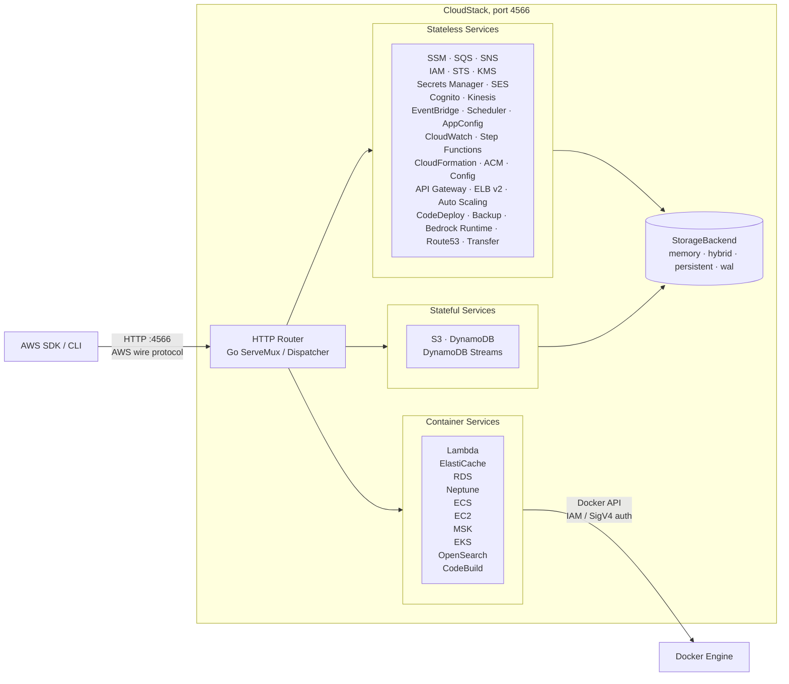

# CloudStack (CoreStack)

**Light, fluffy, and always free.**
A Go-native local AWS emulator for development, testing, and CI.

No account. No auth token. No feature gates. Just run it and connect.

---

## What is CloudStack?

CloudStack is a free, open-source local AWS emulator. It provides AWS-shaped services on your local machine without requiring a cloud account, an auth token, or paid feature gates. Point your AWS SDK, CLI, Terraform, CDK, OpenTofu, or test suite at `http://localhost:4566` and maintain your existing workflows.

Originally rewritten from Java to Go, this emulator is incredibly lightweight, starts in milliseconds, and provides high-fidelity local AWS testing.

## Quick Start

### Building and Running Locally

Ensure you have Go 1.24+ installed.

```bash
# Build the binary
go build -o cloudstack ./cmd/cloudstack

# Run it
./cloudstack
```

### Using Docker Compose

Create a `docker-compose.yml` file:

```yaml
services:
  cloudstack:
    build: .
    ports:
      - "4566:4566"
    volumes:
      # Required for services that use real Docker execution (Lambda, RDS, etc.)
      - /var/run/docker.sock:/var/run/docker.sock
      # Persistent data directory
      - ./data:/app/data
```

Start CloudStack:

```bash
docker compose up -d
```

### Configure your AWS Environment

Export the AWS environment variables in your terminal:

```bash
export AWS_ENDPOINT_URL=http://localhost:4566
export AWS_DEFAULT_REGION=us-east-1
export AWS_ACCESS_KEY_ID=test
export AWS_SECRET_ACCESS_KEY=test
```

Use your existing AWS tools normally:

```bash
aws s3 mb s3://my-bucket

aws dynamodb create-table \
  --table-name demo-table \
  --attribute-definitions AttributeName=pk,AttributeType=S \
  --key-schema AttributeName=pk,KeyType=HASH \
  --billing-mode PAY_PER_REQUEST

aws dynamodb list-tables
```

## Features

- **Local AWS without the cloud account:** Run AWS-compatible services locally without an AWS account, auth token, or paid feature gates.
- **Real Docker where fidelity matters:** Lambda, RDS, Neptune, ElastiCache, MSK, ECS, EC2, EKS, OpenSearch, and CodeBuild use real Docker-backed execution instead of shallow mocks.
- **Drop-in AWS compatibility:** Point standard AWS clients at `http://localhost:4566`. Existing credentials, regions, SDKs, CLI commands, and IaC workflows stay familiar.
- **Fast enough for CI:** The Go-native binary starts in ~10 milliseconds and keeps idle memory low (~15 MiB), making it practical for local development and test pipelines.
- **Configurable persistence:** Choose from in-memory, persistent, hybrid, and write-ahead log storage depending on the durability profile you need.

## Architecture Overview



## Supported Services

CloudStack supports local emulation for over 50 AWS services, including application services, data services, eventing, identity, infrastructure, billing, and container-backed workloads.

| Category | Services |
|---|---|
| **Core app services** | S3, SQS, SNS, DynamoDB, Lambda, IAM, STS, KMS, Secrets Manager |
| **Events and workflows** | EventBridge, Pipes, Scheduler, Step Functions, CloudWatch |
| **API and identity** | API Gateway REST/v2, Cognito, ACM, Route53 |
| **Containers and compute** | ECS, EC2, EKS, CodeBuild, CodeDeploy, Auto Scaling, ELB v2 |
| **Graph & Data** | Neptune, Athena, Glue, Firehose, OpenSearch |
| **Messaging and transfer** | SES, Kinesis, Transfer Family |

### Real Docker Integration

CloudStack uses real Docker containers when in-process emulation would reduce fidelity. This applies to stateful databases, connection-heavy protocols, runtimes, and build systems.

* **Lambda:** Uses `public.ecr.aws/lambda/<runtime>` for execution.
* **Databases:** Pulls official images for PostgreSQL, MySQL, MariaDB, and Valkey/Redis.
* **Streaming:** Uses Redpanda for MSK emulation.

## SDK Integration Examples

Point your existing AWS SDK at `http://localhost:4566`.

### Go, AWS SDK v2

```go
package main

import (
    "context"
    "fmt"
    "log"

    "github.com/aws/aws-sdk-go-v2/config"
    "github.com/aws/aws-sdk-go-v2/credentials"
    "github.com/aws/aws-sdk-go-v2/service/s3"
)

func main() {
    cfg, err := config.LoadDefaultConfig(context.TODO(),
        config.WithRegion("us-east-1"),
        config.WithCredentialsProvider(
            credentials.NewStaticCredentialsProvider("test", "test", ""),
        ),
        config.WithBaseEndpoint("http://localhost:4566"),
    )
    if err != nil {
        log.Fatal(err)
    }

    client := s3.NewFromConfig(cfg, func(o *s3.Options) {
        o.UsePathStyle = true
    })

    out, err := client.ListBuckets(context.TODO(), nil)
    if err != nil {
        log.Fatal(err)
    }

    fmt.Println(out.Buckets)
}
```

### Python, boto3

```python
import boto3

client = boto3.client(
    "ssm",
    endpoint_url="http://localhost:4566",
    region_name="us-east-1",
    aws_access_key_id="test",
    aws_secret_access_key="test",
)

client.put_parameter(
    Name="/demo/app/message",
    Value="hello from CloudStack",
    Type="String",
    Overwrite=True,
)

response = client.get_parameter(Name="/demo/app/message")
print(response["Parameter"]["Value"])
```

## Configuration

All settings are overridable through environment variables with the `CLOUDSTACK_` prefix.

| Variable | Default | Description |
|---|---|---|
| `CLOUDSTACK_PORT` | `4566` | Port exposed by the CloudStack API |
| `CLOUDSTACK_DEFAULT_REGION` | `us-east-1` | Default AWS region |
| `CLOUDSTACK_DEFAULT_ACCOUNT_ID` | `000000000000` | Default AWS account ID |
| `CLOUDSTACK_STORAGE_MODE` | `memory` | Storage mode: `memory`, `persistent`, `hybrid`, or `wal` |
| `CLOUDSTACK_STORAGE_PERSISTENT_PATH` | `./data` | Directory used for persisted state |

## Multi-Account Isolation

CloudStack supports per-account resource isolation. If `AWS_ACCESS_KEY_ID` is exactly 12 digits, CloudStack uses it as the account ID. Resources created by one account are invisible to another.

```bash
AWS_ACCESS_KEY_ID=111111111111 aws sqs create-queue --queue-name orders
AWS_ACCESS_KEY_ID=222222222222 aws sqs create-queue --queue-name orders
```

Any other key format falls back to `CLOUDSTACK_DEFAULT_ACCOUNT_ID` (`000000000000`).
