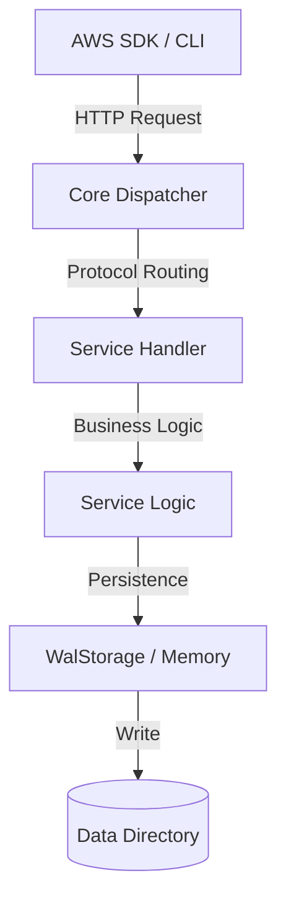

# CloudStack Services Documentation (Go Edition)

All services in CloudStack follow a consistent architectural pattern to ensure AWS SDK compatibility and persistence.

## Common Architecture

Each service is located in `internal/services/<service_name>` and contains:

1.  **Model (`/model/models.go`):** Structs representing AWS entities (e.g., `Bucket`, `User`, `Table`). These include JSON tags for persistence and API responses.
2.  **Service (`service.go`):** The business logic layer. It handles entity lifecycle, ID generation, and interacts with the storage backends.
3.  **Handler (`handler.go`):** The protocol layer. It implements either `HandleJSON` (for JSON 1.0/1.1), `HandleQuery` (for XML/Query), or `ServeHTTP` (for REST/S3/Lambda).

### Request Flow Diagram

---

## Service Directory

| Service | Protocol | Storage | Status |
| :--- | :--- | :--- | :--- |
| **ACM** | JSON 1.1 | WAL | [x] Ported |
| **API Gateway** | REST | WAL | [x] Ported |
| **AppConfig** | JSON 1.1 | WAL | [x] Ported |
| **AppSync** | JSON 1.1 | WAL | [x] Ported |
| **Athena** | JSON 1.1 | WAL | [x] Ported |
| **AutoScaling** | Query | WAL | [x] Ported |
| **Backup** | JSON 1.1 | WAL | [x] Ported |
| **Bedrock Runtime** | REST | N/A | [x] Ported |
| **CloudFormation** | Query | WAL | [x] Ported |
| **CloudFront** | REST/XML | WAL | [x] Ported |
| **CloudWatch** | Query | WAL | [x] Ported |
| **CodeBuild** | JSON 1.1 | WAL | [x] Ported |
| **CodeDeploy** | JSON 1.1 | WAL | [x] Ported |
| **Cognito** | JSON 1.1 | WAL | [x] Ported |
| **Config** | JSON 1.1 | WAL | [x] Ported |
| **Cost Explorer (CE)** | JSON 1.1 | N/A | [x] Ported |
| **CUR** | JSON 1.1 | WAL | [x] Ported |
| **DynamoDB** | JSON 1.0 | WAL | [x] Ported |
| **EC2** | Query | WAL | [x] Ported |
| **ECR** | JSON 1.1 | WAL | [x] Ported |
| **ECS** | JSON 1.1 | WAL | [x] Ported |
| **EKS** | JSON 1.1 | WAL | [x] Ported |
| **ElastiCache** | Query | WAL | [x] Ported |
| **ELBv2** | Query | WAL | [x] Ported |
| **EventBridge** | JSON 1.1 | WAL | [x] Ported |
| **Firehose** | JSON 1.1 | WAL | [x] Ported |
| **Glue** | JSON 1.1 | WAL | [x] Ported |
| **IAM** | Query | WAL | [x] Ported |
| **Kinesis** | JSON 1.1 | WAL | [x] Ported |
| **KMS** | JSON 1.1 | WAL | [x] Ported |
| **Lambda** | REST | WAL | [x] Ported |
| **MSK** | JSON 1.1 | WAL | [x] Ported |
| **Neptune** | Query | WAL | [x] Ported |
| **OpenSearch** | REST/JSON | WAL | [x] Ported |
| **Pipes** | JSON 1.1 | WAL | [x] Ported |
| **Pricing** | JSON 1.1 | N/A | [x] Ported |
| **RDS** | Query | WAL | [x] Ported |
| **Resource Tagging** | JSON 1.1 | WAL | [x] Ported |
| **Route53** | REST/XML | WAL | [x] Ported |
| **S3** | REST | File/WAL | [x] Ported |
| **Scheduler** | JSON 1.1 | WAL | [x] Ported |
| **Secrets Manager** | JSON 1.1 | WAL | [x] Ported |
| **SES** | Query | WAL | [x] Ported |
| **SNS** | Query | WAL | [x] Ported |
| **SQS** | Query | WAL | [x] Ported |
| **SSM** | JSON 1.1 | WAL | [x] Ported |
| **Step Functions** | JSON 1.0 | WAL | [x] Ported |
| **Textract** | JSON 1.1 | N/A | [x] Ported |
| **Transcribe** | JSON 1.1 | WAL | [x] Ported |
| **Transfer** | JSON 1.1 | WAL | [x] Ported |

---

## Detailed Service Workings

### Compute Services (Lambda, EC2, ECS, EKS)
These services manage the lifecycle of virtual compute resources. Metadata is stored in WAL, while heavy artifacts (like Lambda ZIPs or ECR images) are stored in the local file system under `./data`.

### Storage Services (S3, DynamoDB)
*   **S3:** Direct mapping of bucket/key to directory/file.
*   **DynamoDB:** In-memory indexing of items with background WAL synchronization for persistence.

### Messaging Services (SQS, SNS, EventBridge, Pipes)
*   **SQS/SNS:** Uses memory-resident buffers for messages with asynchronous delivery triggers.
*   **EventBridge:** Implements pattern matching logic to route events to registered targets.

### Security Services (IAM, STS, Cognito, KMS, Secrets Manager)
*   **IAM/Cognito:** Manages multi-tenant identity partitions using the `AccountAwareBackend`.
*   **KMS:** Provides cryptographic stubs for encryption/decryption operations.
*   **STS:** Resolves temporary credentials and caller identity from Authorization headers.
