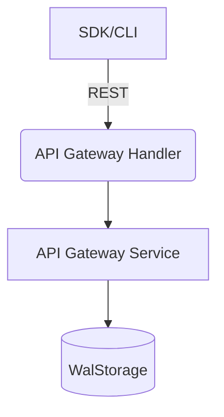

# API Gateway Service

## Overview
The API Gateway service emulates the management of REST and HTTP APIs.

## Structure
`internal/services/apigateway/`
- `model/models.go`: Defines `RestApi`, `Resource`, and `Deployment`.
- `service.go`: Manages API hierarchy and parent-child resource relationships.
- `handler.go`: Implements the management REST API.

## Working Logic
1.  **Hierarchy:** Resources are stored with `ParentId` to build the full path (e.g. `/users/{id}`).
2.  **Persistence:** API and Resource definitions are stored in `WalStorage`.

## Architecture

