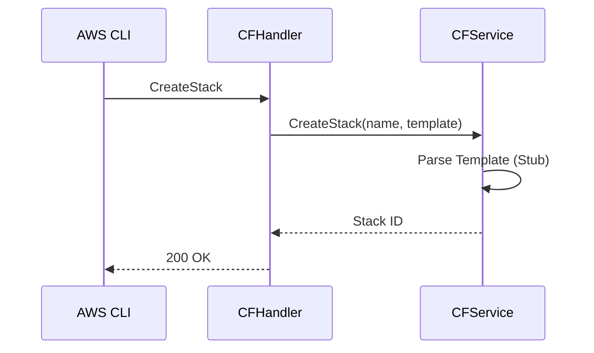

# CloudFormation Service

## Overview
The CloudFormation service emulates the creation and management of infrastructure stacks.

## Structure
`internal/services/cloudformation/`
- `model/models.go`: Defines `Stack` and `Parameter`.
- `service.go`: Manages stack lifecycle and state transitions.
- `handler.go`: Implements the `AwsQuery` protocol.

## Working Logic
1.  **Stack Management:** Currently supports basic `CreateStack` and `DescribeStacks` operations.
2.  **Persistence:** Stack state is stored in `WalStorage`.

## Architecture

