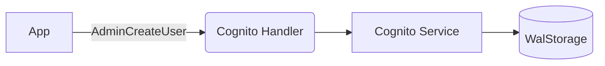

# Cognito Service

## Overview
The Cognito service emulates User Pools for identity management.

## Structure
`internal/services/cognito/`
- `model/models.go`: Defines `UserPool`, `UserPoolClient`, and `CognitoUser`.
- `service.go`: Manages user pools and user attributes.
- `handler.go`: Implements the `AwsJson1.1` protocol.

## Working Logic
1.  **Identity Store:** Users are stored per User Pool with full attribute support.
2.  **Persistence:** All pools and users are persisted via `WalStorage`.

## Architecture

