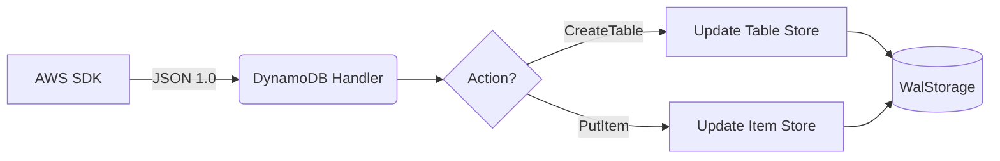

# DynamoDB Service

## Overview
The DynamoDB service emulates AWS NoSQL database service, supporting table creation and item operations.

## Structure
`internal/services/dynamodb/`
- `model/models.go`: Defines `TableDefinition`, `AttributeDefinition`, and `KeySchemaElement`.
- `service.go`: Manages table metadata and item indexing.
- `handler.go`: Implements the `AwsJson1.0` protocol.

## Working Logic
1.  **Item Indexing:** Items are indexed in-memory using a map of `tableKey -> itemKey -> json`.
2.  **Persistence:** Table definitions and item maps are persisted to disk via `WalStorage`.
3.  **Key Generation:** Automatically builds composite keys from HASH and RANGE attributes for fast lookups.

## Architecture

