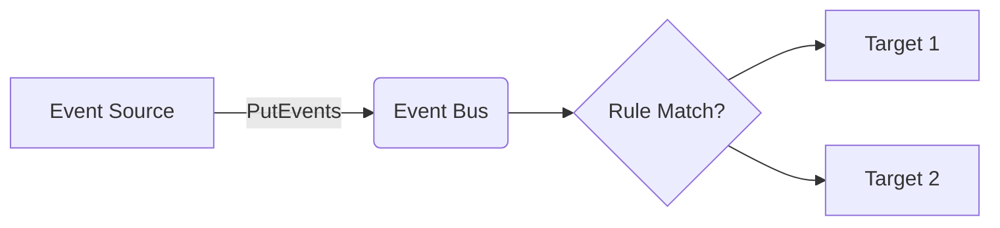

# EventBridge Service

## Overview
The EventBridge service emulates event buses and routing rules.

## Structure
`internal/services/eventbridge/`
- `model/models.go`: Defines `EventBus`, `Rule`, and `Target`.
- `service.go`: Manages event routing and target registration.
- `handler.go`: Implements the `AwsJson1.1` protocol.

## Working Logic
1.  **Routing:** Rules are matched based on event patterns (stubbed logic).
2.  **Persistence:** Buses, Rules, and Targets are stored in `WalStorage`.

## Architecture

