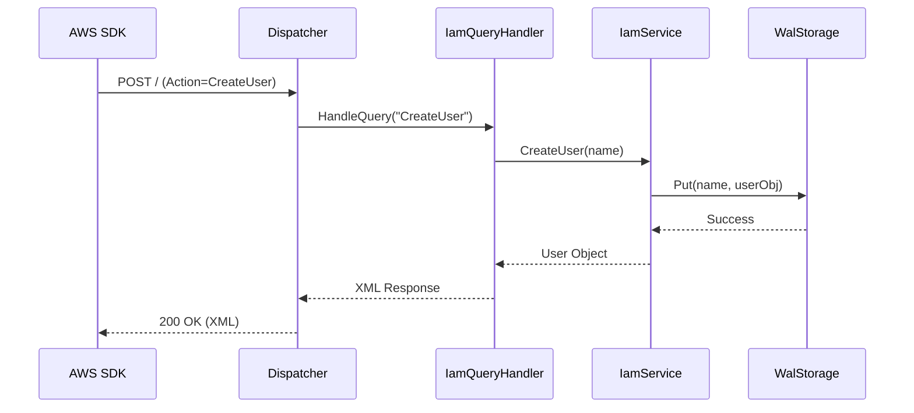

# IAM Service (Identity and Access Management)

## Overview
The IAM service emulates AWS Identity and Access Management, allowing the creation and management of Users, Roles, and Access Keys.

## Structure
`internal/services/iam/`
- `model/models.go`: Defines `User`, `Role`, `AccessKey`, and `Policy` structs.
- `service.go`: Contains the core logic for managing identities and generating AWS-compliant IDs (e.g., `AKIA...`).
- `handler.go`: Implements the `AwsQuery` protocol to handle actions like `CreateUser` and `CreateAccessKey`.

## Working Logic
1.  **Persistence:** Uses `WalStorage` to ensure Users and Keys persist across restarts.
2.  **Account Isolation:** Keys are prefixed with the Account ID to ensure multi-account isolation.
3.  **ARN Generation:** Automatically generates standard AWS ARNs for all resources.

## Architecture

