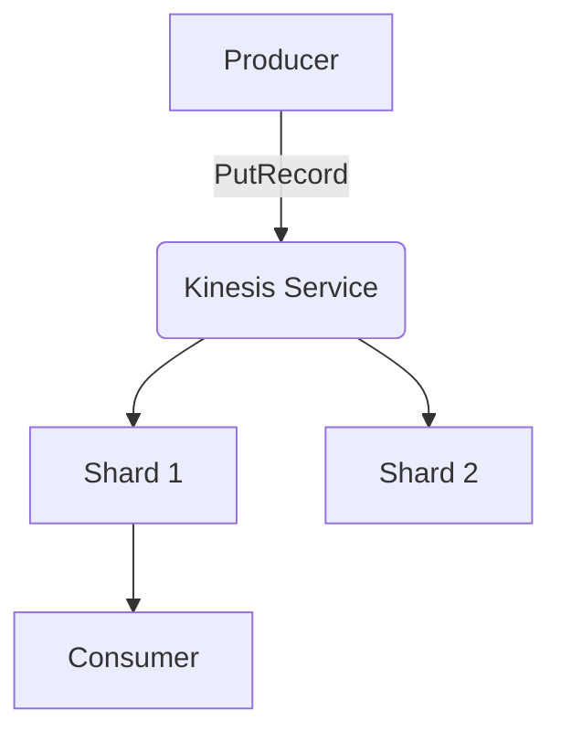

# Kinesis Service

## Overview
The Kinesis service emulates data streams for real-time data processing.

## Structure
`internal/services/kinesis/`
- `model/models.go`: Defines `KinesisStream` and `KinesisRecord`.
- `service.go`: Manages stream shards and record buffering.
- `handler.go`: Implements the `AwsJson1.1` protocol.

## Working Logic
1.  **Sharding:** Automatically generates shard IDs on stream creation.
2.  **Buffering:** Records are buffered in-memory per stream.
3.  **Persistence:** Stream metadata is stored in `WalStorage`.

## Architecture

