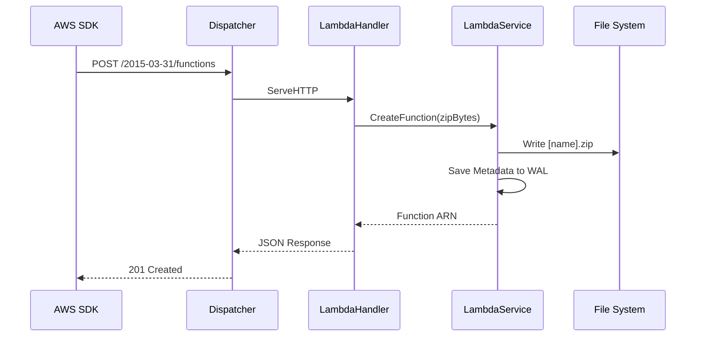

# Lambda Service

## Overview
The Lambda service emulates AWS Lambda, managing function definitions and code artifacts.

## Structure
`internal/services/lambda/`
- `model/models.go`: Defines `LambdaFunction` and `InvokeResult`.
- `service.go`: Manages function lifecycle and code zip storage.
- `handler.go`: Implements the Lambda REST API (`/2015-03-31/functions`).

## Working Logic
1.  **Function Management:** Function metadata (Runtime, Handler, Role) is stored in `WalStorage`.
2.  **Code Artifacts:** Zip files are stored in `./data/lambda/[functionName].zip`.
3.  **Invocation:** Currently provides a stub for execution, ready for Docker SDK integration to run actual containers.

## Architecture

