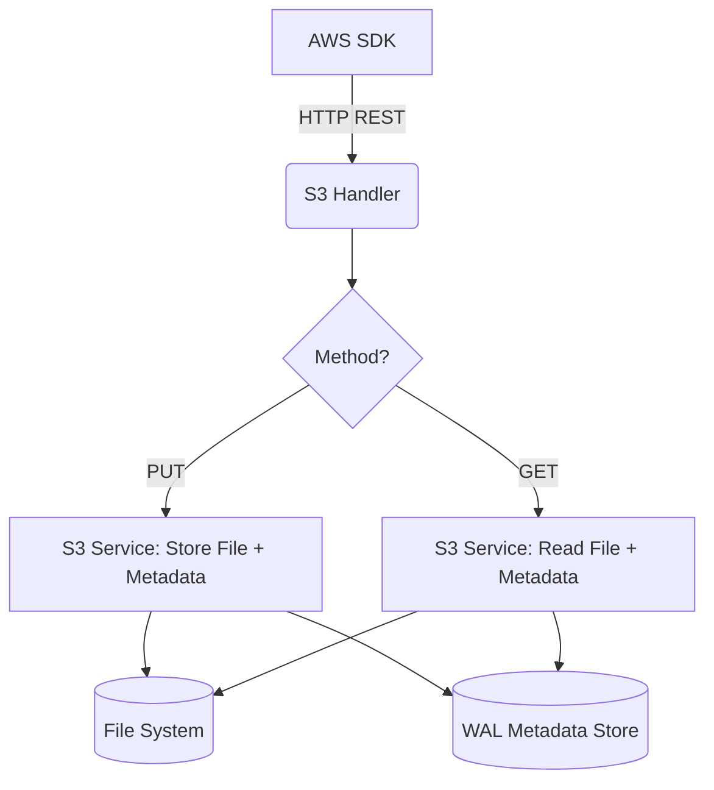

# S3 Service (Simple Storage Service)

## Overview
The S3 service emulates object storage, supporting buckets and object operations (Put, Get, List).

## Structure
`internal/services/s3/`
- `model/models.go`: Defines `Bucket` and `S3Object` structs.
- `service.go`: Manages file system interaction for object data and WAL for metadata.
- `handler.go`: Implements the S3 REST API (Path-style).

## Working Logic
1.  **Data Storage:** Object content is stored as physical files in `./data/s3/[bucket]/[key]`.
2.  **Metadata Storage:** Object metadata (ETag, Content-Type) is stored in the `WalStorage` for fast indexing.
3.  **Routing:** The core dispatcher falls back to S3 for any request that doesn't match a known JSON/Query service target.

## Architecture

