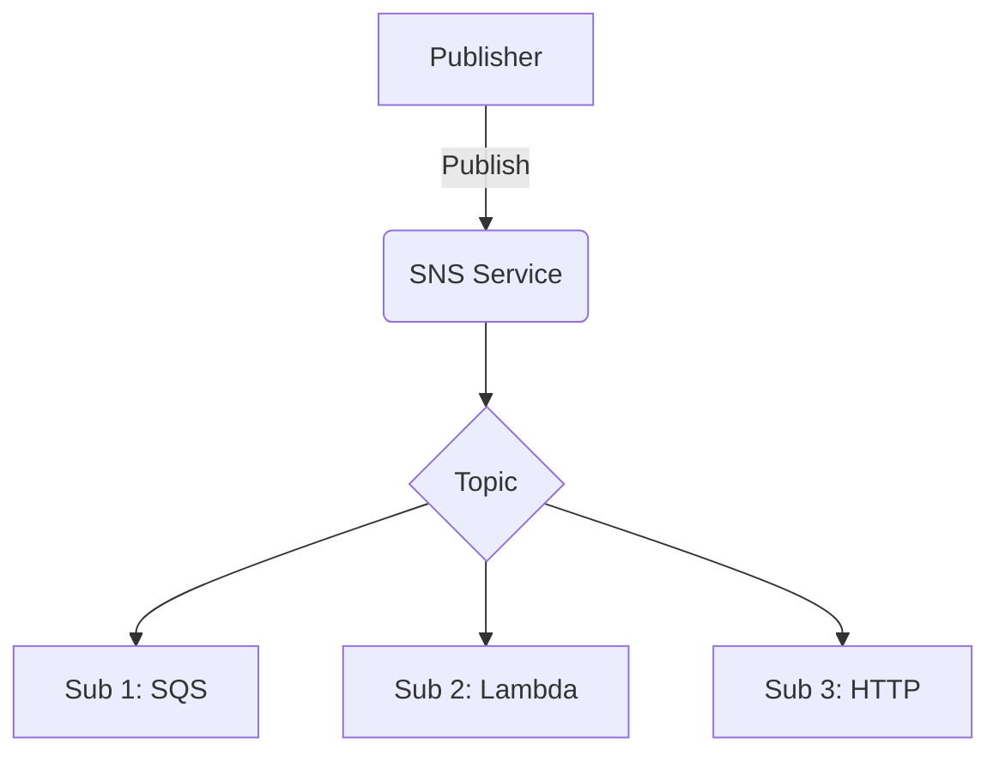

# SNS Service (Simple Notification Service)

## Overview
The SNS service emulates AWS pub/sub messaging.

## Structure
`internal/services/sns/`
- `model/models.go`: Defines `Topic` and `Subscription`.
- `service.go`: Manages topic-subscription mapping.
- `handler.go`: Implements the `AwsQuery` protocol.

## Working Logic
1.  **Pub/Sub:** Supports creating topics and registering endpoints (SQS, Lambda, etc.).
2.  **Persistence:** Topics and Subscriptions are stored in `WalStorage`.

## Architecture

