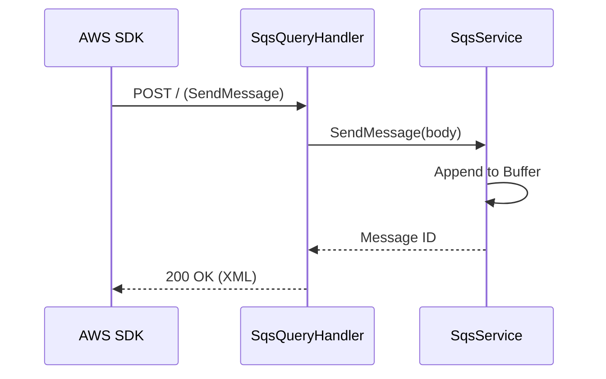

# SQS Service (Simple Queue Service)

## Overview
The SQS service emulates AWS message queuing, supporting queue management and message delivery.

## Structure
`internal/services/sqs/`
- `model/models.go`: Defines `Queue` and `Message` structs.
- `service.go`: Manages message buffers and visibility timeouts.
- `handler.go`: Implements the `AwsQuery` protocol.

## Working Logic
1.  **Queue Buffering:** Messages are buffered in memory-resident slices per queue.
2.  **Visibility Timeout:** Implements a basic visibility mechanism where messages become invisible for a duration after being received.
3.  **Persistence:** Queue metadata is stored in `WalStorage`.

## Architecture

